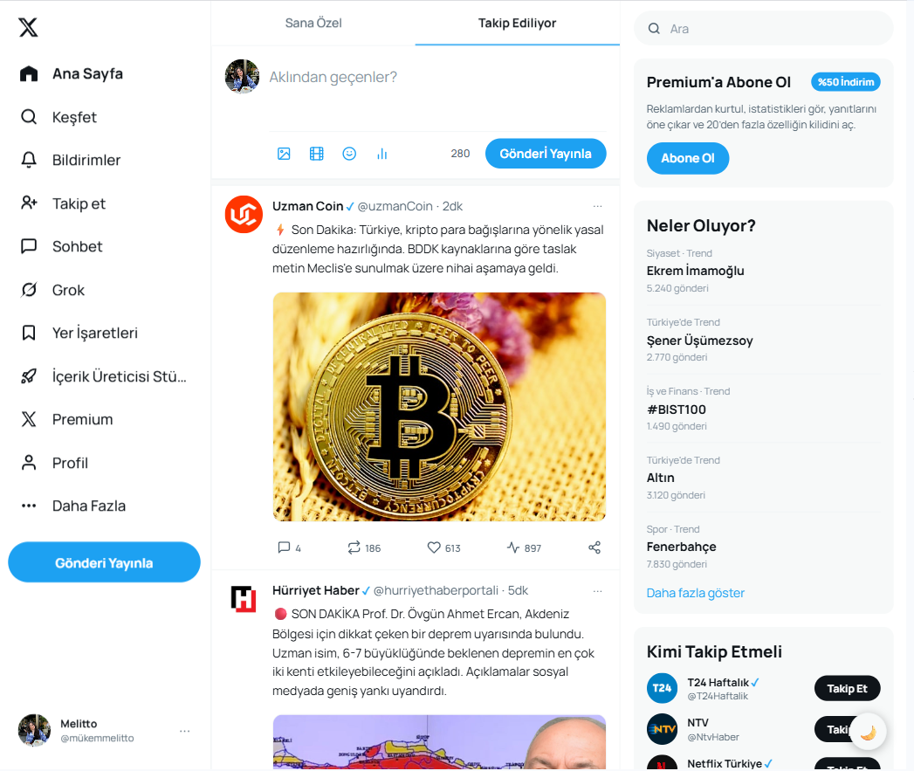
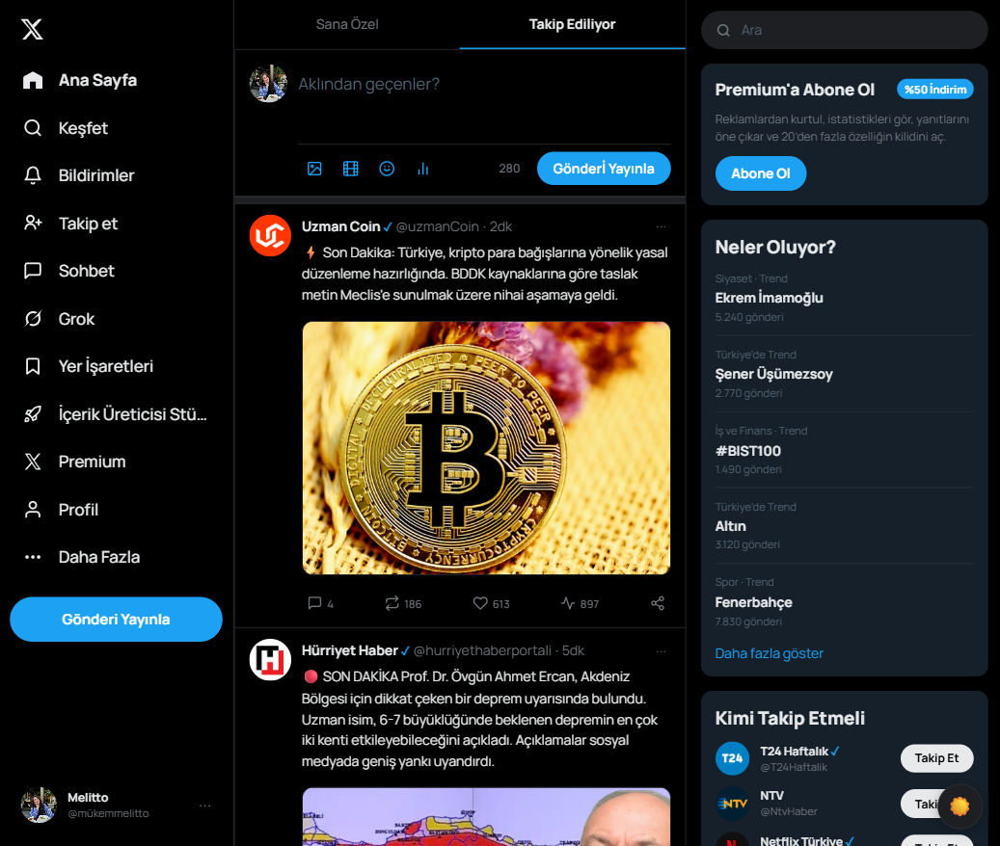
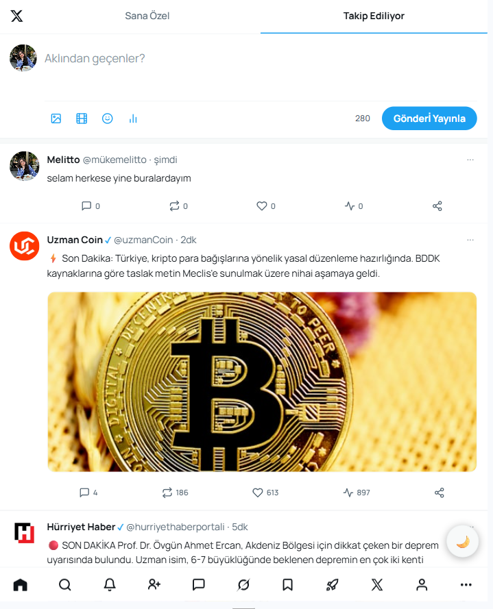
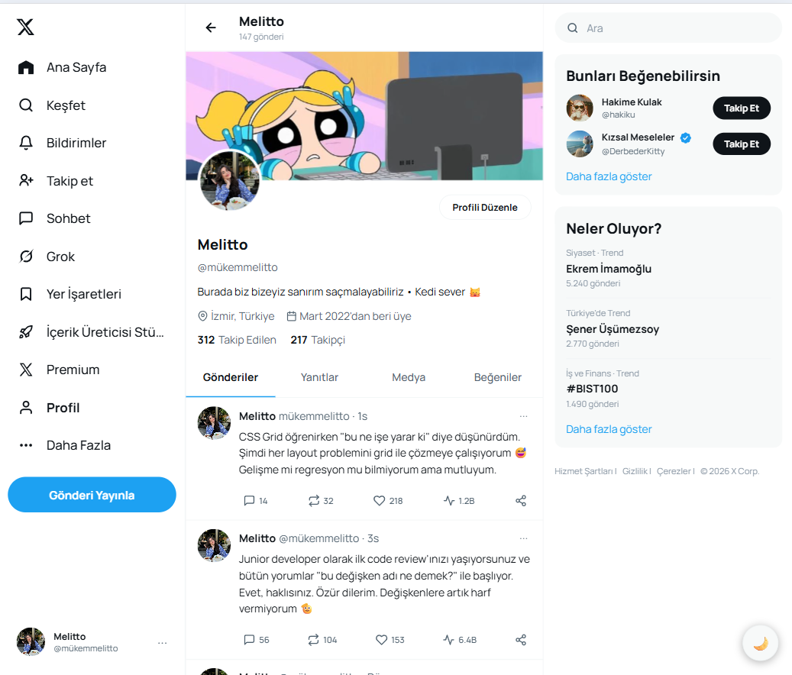

# Twitter Clone

Bu proje, Twitter (X) arayüzünden ilham alınarak geliştirdiğim bir frontend çalışma projesidir. Amaç, gerçek uygulamaya görsel olarak yakın duran, düzenli bir ana sayfa ve profil sayfası oluştururken aynı zamanda temel kullanıcı etkileşimlerini de JavaScript ile desteklemekti.

Projeyi yaparken özellikle **sayfa yerleşimi**, **bileşen mantığı**, **tema geçişi**, **tweet etkileşimleri** ve **responsive yapı** üzerine çalıştım. Tasarım tarafında hem masaüstü hem de daha küçük ekranlarda kullanılabilir bir yapı kurmaya çalıştım.

---

## Proje Amacı

Bu projeyi, modern bir sosyal medya arayüzünü sadece frontend teknolojileri kullanarak yeniden oluşturma pratiği yapmak için geliştirdim. Çalışma boyunca temel hedeflerim şunlardı:

- Twitter benzeri bir ana sayfa akışı oluşturmak
- Profil sayfasını ayrı bir ekran olarak tasarlamak
- Dark / light mode geçişi eklemek
- Tweet gönderme, beğenme ve retweetleme gibi küçük etkileşimler eklemek
- Responsive bir düzen kurmak
- Kod yapısını mümkün olduğunca sade ve geliştirilebilir tutmak

---

## Kullanılan Teknolojiler

- **HTML5**
- **CSS3**
- **JavaScript (Vanilla JS)**
- **Google Fonts - Manrope**
- **LocalStorage** (tema bilgisini saklamak için)

Bu projede herhangi bir framework kullanmadım. Amacım, temel frontend bilgileriyle düzen kurmayı ve etkileşim eklemeyi pratik etmekti.

---

## Proje Yapısı

```bash
Twitter-Clone/
│
├── index.html       # Ana sayfa
├── profile.html     # Profil sayfası
├── style.css        # Tüm stiller ve responsive yapı
├── app.js           # Tema, tweet işlemleri ve etkileşimler
└── img/             # Kullanılan görseller
```

---

## Öne Çıkan Özellikler

### 1. Ana sayfa tasarımı
Ana sayfada klasik X düzenine yakın bir yapı kurdum. Sol tarafta sidebar, ortada tweet akışı ve sağ tarafta gündem / öneri alanları yer alıyor.

Bu yapıyı kurarken amacım, sayfanın tek sütunlu basit bir görünüm yerine gerçek bir sosyal medya uygulaması hissi vermesiydi.

### 2. Profil sayfası
Profil ekranını ana sayfadan ayrı tasarladım. Bu sayfada şu alanlara yer verdim:

- banner alanı
- profil fotoğrafı
- kullanıcı bilgileri
- biyografi
- takipçi / takip edilen sayıları
- gönderi sekmeleri
- kullanıcıya ait tweet kartları

Burada özellikle profil düzeninin ana akıştan farklı görünmesine dikkat ettim.

### 3. Dark / Light mode
Projede tema değiştirme özelliği ekledim. Kullanıcı sağ alttaki buton üzerinden temayı değiştirebiliyor.

Bu özelliği ekleme nedenim, hem arayüzü daha modern hale getirmek hem de CSS değişkenleriyle tema yönetimini pratik etmekti.

Tema seçimi `localStorage` içinde tutulduğu için sayfa yenilendiğinde seçilen görünüm korunuyor.

### 4. Tweet gönderme alanı
Ana sayfada kullanıcı yeni bir tweet yazabiliyor. Gönderilen içerik JavaScript ile tweet listesine en üste ekleniyor.

Bu bölümde şunları ekledim:

- karakter sayacı
- boş içerik kontrolü
- yeni tweeti listeye dinamik ekleme
- güvenli metin basımı için HTML escape işlemi

Buradaki amaç, sayfanın sadece statik görünmemesi ve küçük de olsa etkileşimli hissettirmesiydi.

### 5. Beğeni ve retweet etkileşimleri
Mevcut tweet kartlarında ve sonradan eklenen tweetlerde beğeni ve retweet işlemleri çalışıyor.

- Beğenide sayı artıp azalıyor
- Retweet işleminde sayı değişiyor
- Beğeni yapıldığında ikon rengi değişir ve küçük bir animasyon oynar

Bu özelliği özellikle kullanıcı aksiyonlarına küçük ama görünür tepkiler vermek için ekledim.

### 6. Responsive tasarım
Projede tablet ve mobil ekranlar için media query yapısı kurdum.

Responsive tarafta yaptıklarım:

- sidebar yapısını küçük ekranlarda sadeleştirme
- mobil görünümde sağ paneli gizleme
- alt menü benzeri bir navigasyon yapısına geçiş
- görsel ve metin boyutlarını küçültme
- tweet aksiyonlarını mobil kullanımda daha dengeli dağıtma

Bu sayede proje sadece masaüstünde değil, daha küçük ekranlarda da kullanılabilir hale geldi.

---

## Tasarım Kararları

Projeyi geliştirirken bazı tercihleri özellikle yaptım:

### CSS değişkenleri kullanmamın nedeni
Renkleri, boşlukları ve temel ölçüleri tek yerden yönetmek istedim. Bu sayede hem dark/light mode geçişi kolaylaştı hem de stil dosyası daha kontrollü hale geldi.

### Tek bir CSS dosyası kullanmamın nedeni
Proje küçük ve orta ölçekli olduğu için stilleri tek dosyada toplamak yönetmeyi kolaylaştırdı. Aynı zamanda yapıyı bozmadan geliştirme yapabilmek daha rahat oldu.

### Vanilla JavaScript kullanmamın nedeni
Bu projede DOM işlemleri, event yönetimi ve localStorage kullanımını pratik etmek için vanilla JavaScript kullandım. Küçük etkileşimler için framework kullanmadan ilerlemek benim için daha faydalı oldu.

### Gerçeğe yakın ama birebir olmayan içerikler kullanmamın nedeni
Arayüzü daha canlı göstermek için farklı kullanıcı kartları, haber tweetleri ve profil gönderileri ekledim. Böylece proje sadece boş bir şablon gibi görünmedi.

---
## Ekran Görselleri

### Ana Sayfa

#### Aydınlık Mod


#### Karanlık Mod


#### Mobil Görünüm


---

### Profil Sayfası


